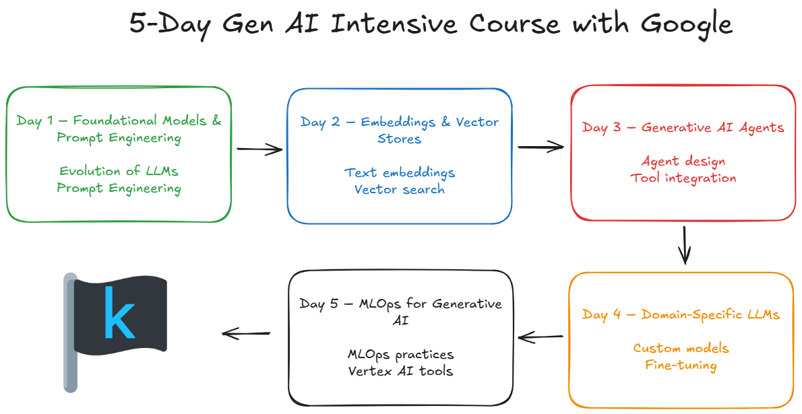

# 5-Day Gen AI Intensive Course with Google – Learn Guide

<picture>
  <source srcset="docs/images/readme-dark.png" media="(prefers-color-scheme: dark)">
  
</picture>

 

> **Our 2025 new course is currently open for registration!**  
> 👉 [Register here](https://rsvp.withgoogle.com/events/google-generative-ai-intensive_2025q1)

Welcome to our **5-Day Gen AI Intensive Course with Google**!  
This was a live event from **November 11–15, 2024**, now made available as a self-paced learning guide for anyone interested in learning the fundamental technologies and techniques behind Generative AI.

---

## What’s Covered

- **Day 1:** Foundational Models & Prompt Engineering  
- **Day 2:** Embeddings and Vector Stores/Databases  
- **Day 3:** Generative AI Agents  
- **Day 4:** Domain-Specific LLMs  
- **Day 5:** MLOps for Generative AI  

**Best of Luck!**  
*Brought to you by Anant Nawalgaria, Mark McDonald, Paige Bailey, and many other contributors from Google.*

---

## Set Up

Before diving into the daily assignments, follow these steps:

1. **Create a [Kaggle account](https://www.kaggle.com/)** and [learn how Notebooks work](https://www.kaggle.com/docs/notebooks). Don’t forget to [phone verify](https://www.kaggle.com/settings) your account.
2. **Create an [AI Studio](https://aistudio.google.com) account** and generate an [API key](https://aistudio.google.com/app/apikey).
3. **Join our [Kaggle Discord server](http://discord.gg/kaggle)**. Find official announcements in [#5dgai-general-chat](https://discord.gg/C8pKnH5K).  
   Link your Kaggle account to Discord [here](https://kaggle.com/discord/confirmation).

